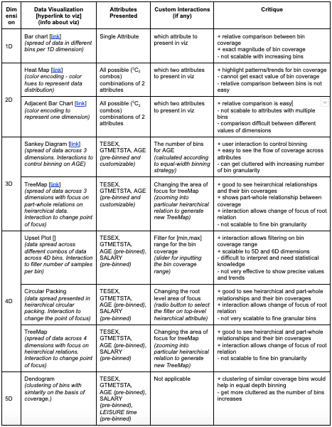

# Data Coverage Toolkit for Multi-dimensional Data

## Abstract
Understanding how the multi-dimensional data is distributed, displayed via visualizations and visually perceived is a challenging task. As computers become more powerful, there is a growing demand for tools that can help us understand and analyze multi-dimensional data distributions and how it can be effectively organized and grouped into different categories. This report presents an overview of the tool developed to create interactive visualizations to present the distribution of data using a mix of user-defined and pre-defined binning techniques. The tool involves generating mult-perspectives of the data, each of which highlights different aspects or grouping distributions of the data. The views are interactively linked and combined to provide more powerful and comprehensive data visualizations. We examine some promising design principles and techniques to create visualizations that aims at exploring data distribution across groupings by different variables. The report also evaluates/critiques upon the different viz techniques developed to build upon better designs and potential areas for future development. 

## About Toolkit

The main idea behind the toolkit is to provide a multi-perspective and interactive approach for exploring and perceiving multi-dimensional data distributions. Binning is fundamental approach in gaining insights about the data distributions and and outlier detection. The number of ways to perform binning explodes exponentially with the increase in the number of dimensions and directly depends upon the bin range per dimension. Things get visually intractable to comprehend when the dimensions are continuous variables and there can be infinite bins possible. To keep the tool simple and build upon the fundamentals of data binning, the tool is designed to work with a set of 5 dimensions of the dataset. These dimensions are pre-defined into different bins to enable tractable computations for binning and to enable ease of understanding for the user. For example, categorization of age dimension into predefined discrete categories is essential for the toolkit to present the data spread over the categories for all unique combinations across different dimensions

There are two main components involved in the proposed toolkit - Binning algorthims and data visualizations. Binning algorithms represents the core computing logic behind different strategies employed to group data points across different multi-dimensional bins. The data visualization subpart acts as the bridge in between the core computing logic of binning and the human perception. It is via data visualizations toolkit provides multi-perspective approach for perceiving the multi-dimensional data distributions. Interactions plays a key role here since there are exponential number of different paths in the heirarchical tree for different dimensions. Interactions makes it possible for the user to explore different paths via decisions on which dimension to consider and what kind of binning is performed.

## Setup Instructions

Refer to Setup.md for details for installing the required libraries for the toolkit and execution of the toolkit 

## Data Visualizations

